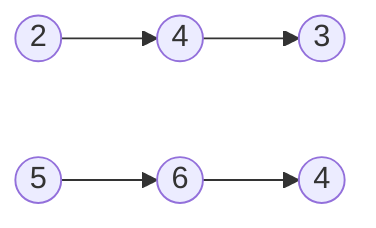
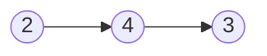

# Add Two Numbers

`addTwoNumbers` fonksiyonu iki adet birer tamsayıyı temsil eden ve boş olmayan bağlantılı listeyi `(linked list)` parametre olarak alır. Rakamlar bağlantılı listede ters sırada konumlandırılmıştır ve her biri tek bir rakam içerir. Verilen iki sayıyı toplayın ve toplamı bir bağlantılı liste ile döndürün.

Bu iki sayının kendisi sıfır olmadığı sürece ilk basamağının sıfır içermediğini varsayabilirsiniz.

**Örnek 1:**

**Girdi:** `l1 = [2, 4, 3], l2 = [5, 6, 4]`
**Çıktı:** `[7, 0, 8]`
**Açıklama:** `342 + 465 = 807.`

**Örnek 2:**

**Girdi:** `l1 = [0], l2 = [0]`
**Çıktı:** `[0]`

**Örnek 3:**

**Girdi:** `l1 = [9,9,9,9,9,9,9], l2 = [9,9,9,9]`
**Çıktı:** `[8,9,9,9,0,0,0,1]`

**Kısıtlar:**
-   Her bağlantılı listedeki `(Linked List)` düğüm  `(Node)`sayısı  `[1, 100]` arasındadır..
-   `0 <= Node.val <= 9` (Her düğüm sadece bir rakam tutabilir.)
-   Listenin ilk düğümü sıfır içermeyen bir sayıyı temsil eder.

